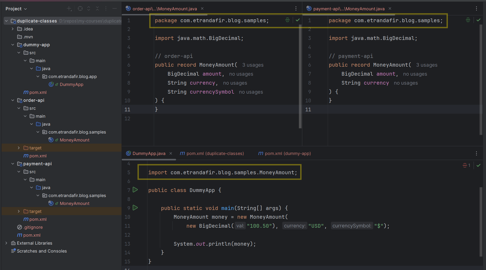

# The Case of the Vanishing Schema Field

*Published: December 27, 2025*

[`#debugging`](/#debugging) [`#design`](/#design) [`#kafka`](/#kafka)

This is the story of a bug that appeared and disappeared at random.
It's about decompiled JARs, schema ownership, code generation, and the JVM classloader.

## The Setup

Our microservices relied on Apache Avro for serializing data through Kafka.
At the center of it all was a simple schema: _MoneyAmount.avsc_.

```json
{
  "namespace": "com.etrandafir.blog.samples",
  "type": "record",
  "name": "MoneyAmount",
  "fields": [
    {"name": "amount", "type": "double"},
    {"name": "currency", "type": "string"}
  ]
}
```

When we looked into how to make the change, we discovered that _Order.avsc_ and _MoneyAmount.avsc_ 
lived in different repositories.
The _order-api_ library was pulling in _MoneyAmount.avsc_ from its remote location 
to generate the Java classes during build time.

At some point, somebody had tried to build _MoneyAmount_ as a separate JAR in a commons library.
But that didn't work—libraries like _order-api_ needed the _MoneyAmount.avsc_ file itself 
during their build process
to generate Java classes from schemas that referenced it.
So that initiative got abandoned pretty quick, and we kept the setup as-is.

## The Change

One day, a requirement came in: _"We need the currency symbol (like $, €, £) in our Order events."_

Simple enough. We added a new field to _MoneyAmount.avsc_:

```json
{
  "namespace": "com.etrandafir.blog.samples",
  "type": "record",
  "name": "MoneyAmount",
  "fields": [
    {"name": "amount", "type": "double"},
    {"name": "currency", "type": "string"},
    {"name": "symbol", "type": "string", "default": ""}
  ]
}
```

We updated _order-api_, rebuilt it, ran the tests locally—everything passed.
We pushed to the test environment. Still green. 

We were ready for production.

## Later That Week

Then, a different team integrated a completely unrelated feature. 
They re-deployed the application to the test environment.

**Boom.**

```plaintext
org.apache.avro.AvroRuntimeException: Unknown field: symbol
```

The application crashed during serialization. _MoneyAmount_ objects suddenly
didn't have a _symbol_ field anymore.

_"It must be the new feature,"_ someone said. We quickly checked
—no, the new feature had nothing to do with orders.
We rolled it back anyway. Restarted the service.

**Everything worked again.**

Wait, what?

## Phantom Restarts and Forgotten Libs

We had a mystery on our hands. The behavior was completely non-deterministic:

- Tests were passing locally
- Tests were passing in CI/CD
- Sometimes the service worked fine after restart
- Sometimes it failed after restart

We pulled the _order-api_ JAR from Artifactory and decompiled it.
There it was—the _MoneyAmount_ class with the _symbol_ field, exactly as expected.
_"The JAR is correct"_ - we thought. _"So what's going on?"_

Then someone asked: _"Are there any other libraries use the _MoneyAmount_ schema?"_
We checked. The _payment-api_ library also had Avro schema generation configured.
It pulled _MoneyAmount.avsc_ and generated its own _MoneyAmount_ java class.

_"When was payment-api last built?"_ 
We checked the timestamps. One month ago. 
Before our schema change.

The pieces started falling into place.

## The Smoking Gun

**Both _order-api_ and _payment-api_ were generating their own _MoneyAmount_ classes
from the same Avro schema**. Since both versions of the schema had the same _namespace_,
both generated classes had the same fully qualified name.

At runtime, **the JVM encountered two different versions of the same class on the classpath**.
Here's the issue, reproduced in a simplified setup.
Which version gets loaded? Will this _main()_ method work or fail?



Turns out **the JVM will silently pick one and discard the other - not even a warning**.
It all depends on the classpath order.

For instance, we can force loading the _order-api.jar_ first
by running the application this way:
```bash
java -cp ^
  "order-api/target/order-api-1.0-SNAPSHOT.jar;^
  payment-api/target/payment-api-1.0-SNAPSHOT.jar;^
  dummy-app/target/dummy-app-1.0-SNAPSHOT.jar" ^
  com.etrandafir.blog.app.DummyApp
```

This will result in the happy path we were usually seeing,
in our example, the _toString()_ of the _MoneyAmount_ object:

```plaintext
MoneyAmount[amount=100.50, currency=USD, currencySymbol=$]
```

On the other hand, we can reverse the order of the JARs,
the _main()_ method will fail to create a _MoneyAmount_ instance.
It'll say it's not aware of a _MoneyAmount_ constructor accepting 
three parameters (amount, currency, symbol),
it only knows the old two-parameter constructor:

```plaintext
Exception in thread "main" java.lang.NoSuchMethodError: 
    'void com.etrandafir.blog.samples.MoneyAmount.<init>(java.math.BigDecimal, java.lang.String, java.lang.String)'
        at com.etrandafir.blog.app.DummyApp.main(DummyApp.java:10)
```

The JAR ordering was effectively random during service startup, 
which explained the non-deterministic behavior.

## What Went Wrong

We had violated a fundamental principle: **a generated class should have exactly one owner.** 
Our setup allowed multiple libraries to independently generate the same class from the same schema. 
When the schema evolved, each library built its own version at different times, 
creating conflicting definitions on the classpath. 
The JVM's classloader picked one version at random, making the behavior completely non-deterministic.

But there's a deeper issue here.
**In Domain-Driven Design terms, _payment-api_ and _order-api_ represent different bounded contexts.
Each context should own its data models.**
If both contexts needed a money concept, each should have declared its own _MoneyAmount_ schema
—even if they looked similar.
Instead, we had a shared schema with no clear ownership, 
living in a separate repository that neither context truly controlled.

## How We Could Have Caught It Earlier

The service in our test environment was rarely restarted, but our CI/CD pipeline ran tests constantly.
**If we had integration tests that actually went through the Kafka layer**, 
we would have caught this much earlier.

Using tools like Testcontainers or Embedded Kafka would have surfaced the issue.
Sure, this test might have produced some false negatives,
but it would have been failing often enough for us to investigate.

**Another tool that could have saved us is the Maven Enforcer Plugin with 
its [_banDuplicateClasses_](https://www.mojohaus.org/extra-enforcer-rules/banDuplicateClasses.html) rule.**
This plugin scans your dependencies at build time and fails the build 
if it detects multiple JARs providing the same class. 
If we had configured it in our projects, the build would have failed immediately, 
preventing the duplicate _MoneyAmount_ classes from ever reaching our test environment.

Let's add the Maven Enforcer Plugin to our sample project's _pom.xml_:

```xml
<build>
  <plugins>
    <plugin>
      <groupId>org.apache.maven.plugins</groupId>
      <artifactId>maven-enforcer-plugin</artifactId>
      <version>3.6.2</version>
      <executions>
        <execution>
          <id>enforce-ban-duplicate-classes</id>
          <goals>
            <goal>enforce</goal>
          </goals>
          <configuration>
            <rules>
              <banDuplicateClasses>
                <findAllDuplicates>true</findAllDuplicates>
                <ignoreWhenIdentical>true</ignoreWhenIdentical>
              </banDuplicateClasses>
            </rules>
            <fail>true</fail>
          </configuration>
        </execution>
      </executions>
      <dependencies>
        <dependency>
          <groupId>org.codehaus.mojo</groupId>
          <artifactId>extra-enforcer-rules</artifactId>
          <version>1.11.0</version>
        </dependency>
      </dependencies>
    </plugin>
  </plugins>
</build>
```

After configuring this plugin, any attempt to build a project with duplicate classes would fail immediately.
Let's try it out in our sample project:

```plaintext
[INFO] ------------------------------------------------------------------------
[INFO] Reactor Summary for duplicate-classes 1.0-SNAPSHOT:
[INFO] 
[INFO] duplicate-classes .................................. SUCCESS [  0.186 s]
[INFO] payment-api ........................................ SUCCESS [  0.853 s]
[INFO] order-api .......................................... SUCCESS [  0.083 s]
[INFO] dummy-app .......................................... FAILURE [  2.575 s]
[INFO] ------------------------------------------------------------------------
[INFO] BUILD FAILURE
[INFO] ------------------------------------------------------------------------
[INFO] Total time:  3.778 s
[INFO] Finished at: 2025-12-28T17:19:12+02:00
[INFO] ------------------------------------------------------------------------
[ERROR] Failed to execute goal org.apache.maven.plugins:maven-enforcer-plugin:3.6.2:enforce (enforce-ban-duplicate-classes) on project dummy-app: 
[ERROR] Rule 0: org.codehaus.mojo.extraenforcer.dependencies.BanDuplicateClasses failed with message:
[ERROR] Duplicate classes found:
[ERROR] 
[ERROR]   Found in:
[ERROR]     com.etrandafir.blog:payment-api:jar:1.0-SNAPSHOT:compile
[ERROR]     com.etrandafir.blog:order-api:jar:1.0-SNAPSHOT:compile
[ERROR]   Duplicate classes:
[ERROR]     com/etrandafir/blog/samples/MoneyAmount.class
```

## Lessons Learned

- Generated code should have exactly one owner
- Avoid committing generated files—generate during build
- Allow each bounded context to define its own models, even if they look similar
- Unit tests aren't enough

This bug taught us that architectural mistakes don't always fail immediately. 
They lie dormant, waiting for the perfect storm: a schema change, a deployment, 
a classloader race condition.

You can play with a demo project and try the Maven plugin yourself at 
[github.com/etrandafir93/dupped_java_classes](https://github.com/etrandafir93/dupped_java_classes/tree/main).