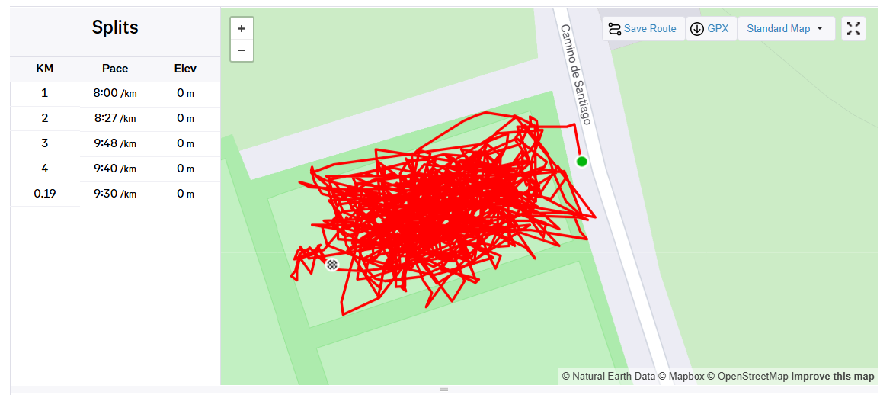
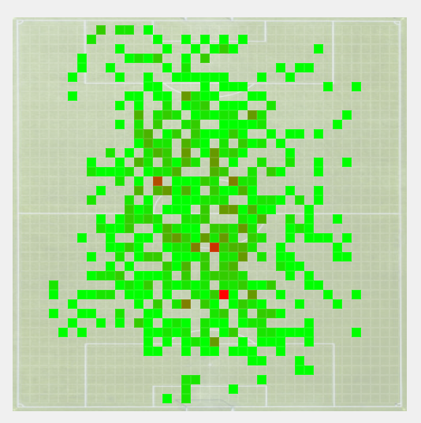

# Clojure Threading for Dummy Java Devs (such as myself)

*Published: August 30, 2024*

Recently, I've been playing around with Clojure. 
I wanted to take advantage of the AI tools available to explore a new language...
and not just Kotlin or Python, but something completely new to me.

One of the features that caught my attention was the threading macros (`->` and `->>`) 
it's a pretty simple feature, but I found it interesting and elegant.

## Strava Heatmaps

A few words about the project I've built in Clojure? 

Well, I'm recording all my sport activities using my Garmin watch, even when I'm playing football.

_When I get home and download my activity, the map looks something like the spaghetti code I 
generate when vibe-coding with ChatGPT:_



Needless to say, I want to visualize my football session a bit better. 
so I decided to build a small app to export this activity as a GPX file 
and generate an HTML heatmap based on it. 
After applying all these steps, we'll expect a heatmap like this:



Basically, we need to:

- parse the GPX file _(GPX is an XML schema designed as a common GPS data)_
- normalize the data
- (optionally) rotate the activity by a given angle
- (optionally) filter the data - for eg.: by running cadence
- generate the heatmap
- generate the HTML file

A functional language sounded like a perfect fit for implementing this pipeline of operations, 
so I decided to give Clojure a try. 

Before diving into the threading macros that make these pipelines so elegant, let's cover some Clojure basics.
If you're coming from Java like me, the syntax might look intimidating at first, 
but the core concepts are actually quite straightforward once you get the hang of the parentheses.

## Clojure Syntax

Let me show you what I understood about Clojure so far. 

The syntax follows a consistent pattern: `(function-name arguments...)` where the function always comes first
inside the parentheses, followed by its arguments. 

For example, if we want to add two numbers _(say 1 and 2)_, we would write: `( + 1 2 )`. 
This is because `+` is the addition function, followed by `1` and `2` - the numbers being added.

We can define a function using the `defn` keyword, followed by the function name, 
its arguments, and the body of the function. Let's write a function that adds two numbers, received as arguments:

```clojure
(defn add [a b] 
  (+ a b))
```

Similarly, when we want to compare numbers, we'll start with the comparison function, 
followed by the numbers to compare. For instance, this is how we verify if two numbers
_(a and b)_ are equal: `( = a b )`

Now let's write a unit test for our `add` function:

```clojure
(deftest add-two-test
  (is 
    (= 3 
      (add 1 2)
    )
  )
)

;; or simply:
(deftest add-two-test
  (is (= 3 (add 1 2))))
```

## The Threading Macros

Look at our test: as simple as it is, it already has quite a few nested function calls.
If we read it from left to right, we can see that we're:

- adding 1 and 2
- comparing the result with 3
- verifying if the result is true

When it comes to pipelines of operations, the threading macros (`->` and `->>`)
allows us to take the result of one operation and pass it as argument to the next operation.

The difference between the two is that `->` (_aka thread-first_) passes the value to the next function
as the first argument, while `->>` (_aka thread-last_) passes the value as the last argument.

Therefore, we can re-write our test as follows:
```clojure
(deftest add-two-test-x
  (->> 1
    (add 2)
    (= 3)
    (is)))
```

And it reads like this:
- we start with the number 1, 
- then we add 2 to it, 
- then we compare the result with 3, 
- and finally we verify if the new result is true.

Of course, this is a very simple example, but it shows the power of the threading macros.

Let's go back to our heatmap pipeline: 
As discussed, we'll start with a GPX file that we need to read as text. 
Then, we'll parse its content and normalize the data.
At this point, we can optionally rotate the activity by a given angle
and/or filter the data. Then, we'll generate the heatmap as a sparse matrix.
Following that, we'll convert the matrix to RGB values, convert it to json and 
inject it into a HTML template. 

Quite a few nested function calls, right? Wait to see them in action:
```clojure
(defn strava-heatmap [file]
  (html/save-file 
    (html/generate-html
      (heatmap/map-to-json
        (heatmap/map-to-rgb
          (heatmap/heatmap-matrix
            (heatmap/normalize-trkpts
              (gpx/xml-to-trkpts
                (gpx/read-file-as-string file)))))))
    (str "out/" (UUID/randomUUID) ".html")))
```

Now, let's re-write it using the threading macros:
we'll start from the GPX file we exported from Strava and thread 
the result of each step as the last argument of the next function:

```clojure
(defn strava-heatmap [file]
  (->> file
    gpx/read-file-as-string
    gpx/xml-to-trkpts
    (heatmap/normalize-trkpts)
    heatmap/heatmap-matrix
    heatmap/map-to-rgb
    heatmap/map-to-json
    (html/generate-html)
    (html/save-file 
      (str "out/" (UUID/randomUUID) ".html"))))
```

Pretty neat, isn't it?

Let's add a step to rotate the activity counter-clockwise by 55 degrees, 
because I want the heatmap to be aligned with the pitch of the field, 
rather than the North-South axis. 

Additionally, let's remove the track points 
with a cadence of less than 10 steps per minute 
(filtering out epic failures as a goalkeeper):

```clojure
(defn strava-heatmap [file]
  (->> file
    gpx/read-file-as-string
    gpx/xml-to-trkpts
    (filter (fn[pt] (> (:cadence pt) 10))) ;; <- filter by cadence
    (heatmap/normalize-trkpts-precision)
    (heatmap/rotate-points -55) ;; <- rotate counter-clockwise by 55 degrees
    heatmap/heatmap-matrix
    heatmap/map-to-rgb
    heatmap/map-to-json
    (html/generate-html)
    (html/save-file 
       (str "out/" (UUID/randomUUID) ".html"))))
```

As we can see, it's much easier to add new steps to the pipeline. 
I also like the fact that you don't really need to know Clojure to be able to read this flow.

Beyond readability, functional pipelines offer significant practical benefits: 
each transformation step is isolated and testable, 
making debugging easier since we can inspect the output at any stage. 
Additionally, pipeline steps can be easily reordered, combined, or parallelized 
without affecting other parts of the system.

## What About Java?

<details>
<summary>What does this remind you of from Java?</summary>
And why the Stream API?
</details>
<br>

Some fluent APIs from Java are inspired from functional programming. 
That's why we can find similar patterns in the Stream API, reactive pipelines...
and even CompletableFuture! 

Jus for fun, let's imagine we wrote this in Java, using the CompletableFuture API 
(this is how the code can look like):

```java
public CompletableFuture<Path> stravaHeatmap(String file) {
    return CompletableFuture
      .supplyAsync(() -> gpx.readFileAsString(file))
      .thenApply(xml -> gpx.xmlToTrkpts(xml))
      .thenApply(pts -> pts.stream()
         .filter(pt -> pt.cadence() > 10).toList())
      .thenApply(pts -> heatmap.normalizeTrkptsPrecision(pts))
      .thenApply(pts -> heatmap.rotatePoints(pts, -55))
      .thenApply(map -> heatmap.heatmapMatrix(map))
      .thenApply(map -> heatmap.mapToRgb(map))
      .thenApply(rgb -> heatmap.mapToJson(rgb))
      .thenApply(json -> htmlUtil.generateHtml(json))
      .thenApply(html -> htmlUtil.saveFile(
          "out/%s.html".frormatted(UUID.randomUUID())), html);
}
```
Needless to say, the Clojure version is much easier to read and reason about.

The threading pattern we see in Clojure aligns perfectly with Data-Oriented Programming (DOP),
a paradigm gaining traction in Java. DOP emphasizes treating data as immutable and flowing it 
through a series of transformations, rather than encapsulating it within objects. 
This approach naturally benefits from threading operators because data transformations become explicit pipeline steps. 


If you want to read more about DOP, check out this [article](https://www.baeldung.com/java-dop-oop-principles-differences)

## Conclusion

In this shoer article, we discussed Clojure's threading macros. 
One of those simple features that make a huge difference in how you write and think about code. 

Whether you're working in Clojure or dreaming of better Java syntax, the pattern is worth understanding.

```text
    Do you think we'll ever get a threading operator in Java?
```
