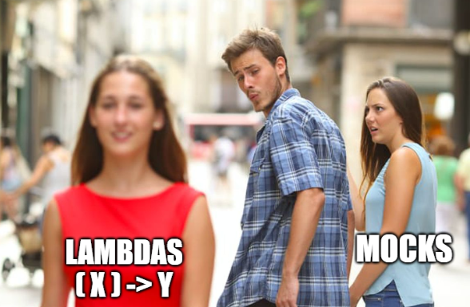
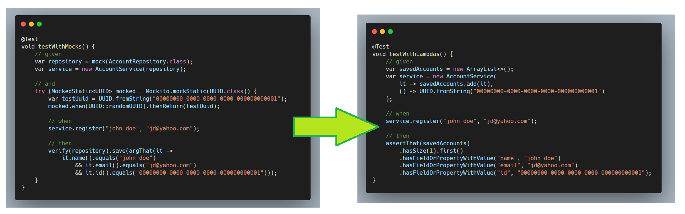

# Less Mocks, More Functions!

*Published: September 28, 2025*

[`#functional programming`](/#functional-programming) [`#design`](/#design) [`#testing`](/#testing) `#java`

After [playing with Clojure](/blog/clojure-threading/), I was amazed by 
how testable everything is in the functional world.

In this article, we'll explore a technique that uses functional interfaces 
to reduce the number of mocks needed for testing.



I started thinking about incorporating some functional techniques into 
my Java development work - without shaking up the codebase too much 
or becoming _"that functional programming person"_ colleagues avoid at the water cooler.

The main idea is simple: **extract dependencies that produce side effects and move them 
outside of the component you want to test**.

## The Problem

This technique is particularly effective when the tested component relies on 
a dependency but utilizes only a select few of its methods, ideally just one.
We'll use Java for the code examples in the article, but the approach 
can be applied regardless of the language or testing frameworks. 

Let's start with a typical example:

```java
class AccountService {
    private final AccountRepository repository;

    AccountService(AccountRepository repository) {
        this.repository = repository;
    }

    void register(String name, String email) {
        var uuid = UUID.randomUUID();
        var account = new Account(uuid.toString(), name, email);
        // some business logic
        repository.save(account);
    }
}
```

To test this without connecting to a database, we need to mock the repository:

```java
@Test
void testWithMocks() {
    var repository = mock(AccountRepository.class);
    var service = new AccountService(repository);

    service.register("john doe", "jd@yahoo.com");

    verify(repository).save(argThat(it ->
        it.name().equals("john doe")
          && it.email().equals("jd@yahoo.com")
          && it.id() != null
    ));
}
```

## Using Functions for Side Effects

If we think about it, we only need a mock because _AccountService::register_ 
produces side effects (saving the _Account_ into the database). Another obvious problem with our design is that we depend on the whole _AccountRepository_
class even though we only use its _save()_ method.

Simply put, our class needs a function that accepts an _Account_ and saves it. 
The signature of this function would be `(Account) -> void`.  
In Java, this function is also known as `Consumer<Account>`.

So, let's change _AccountService_ and make it depend on this function instead of holding the whole repository:

```java
class AccountService {
    private final Consumer<Account> saveAccount;

    AccountService(Consumer<Account> saveAccount) {
        this.saveAccount = saveAccount;
    }

    // Maintain backwards compatibility
    @Autowired
    AccountService(AccountRepository repository) {
        this(repository::save);
    }

    void register(String name, String email) {
        var uuid = UUID.randomUUID();
        var account = new Account(uuid.toString(), name, email);
        // some business logic
        saveAccount.accept(account);
    }
}
```

## Testing Becomes Fun

Now testing becomes much simpler:

```java
@Test
void testWithLambdas() {
    List<Account> savedAccounts = new ArrayList<>();
    var service = new AccountService(savedAccounts::add);

    service.register("john doe", "jd@yahoo.com");

    assertThat(savedAccounts)
      .hasSize(1).first()
      .hasFieldOrPropertyWithValue("name", "john doe")
      .hasFieldOrPropertyWithValue("email", "jd@yahoo.com")
      .hasFieldOrProperty("id");
}
```

Testing exceptions is equally straightforward:

```java
@Test
void testWithLambdas_exceptions() {
    var service = new AccountService(__ -> {
        throw new IllegalArgumentException("test exception");
    });

    assertThatThrownBy(() -> service.register("john doe", "jd@yahoo.com"))
      .isInstanceOf(IllegalArgumentException.class);
}
```

## Handling Static Dependencies

Our code still isn't "pure" because it calls `UUID.randomUUID()`. 
We can apply the same technique here by extracting the UUID generation:

```java
class AccountService {
    private final Consumer<Account> saveAccount;
    private final Supplier<UUID> generateUuid;

    AccountService(Consumer<Account> saveAccount, Supplier<UUID> generateUuid) {
        this.saveAccount = saveAccount;
        this.generateUuid = generateUuid;
    }

    // Backwards compatibility
    @Autowired
    AccountService(AccountRepository repository) {
        this(repository::save, UUID::randomUUID);
    }

    void register(String name, String email) {
        var uuid = generateUuid.get();
        var account = new Account(uuid.toString(), name, email);
        // some business logic
        saveAccount.accept(account);
    }
}
```

Now our tests are completely deterministic:

```java
@Test
void testWithLambdas() {
    List<Account> savedAccounts = new ArrayList<>();
    var service = new AccountService(
        savedAccounts::add,
        () -> UUID.fromString("00000000-0000-0000-0000-000000000001")
    );

    service.register("john doe", "jd@yahoo.com");

    assertThat(savedAccounts)
      .hasSize(1).first()
      .hasFieldOrPropertyWithValue("name", "john doe")
      .hasFieldOrPropertyWithValue("email", "jd@yahoo.com")
      .hasFieldOrPropertyWithValue("id", "00000000-0000-0000-0000-000000000001");
}
```

## Conclusion

By extracting side effects into functions, we've made our code:

✅ **Easier to test** - no mocks needed

✅ **More focused** - our components only depends on what it actually needs

✅ **Backwards compatible** - existing code continues to work

This technique aligns with SOLID principles (specifically Interface Segregation and Dependency Inversion)
while borrowing useful concepts from functional programming. 
The result is cleaner, more testable code that's easier to reason about.

