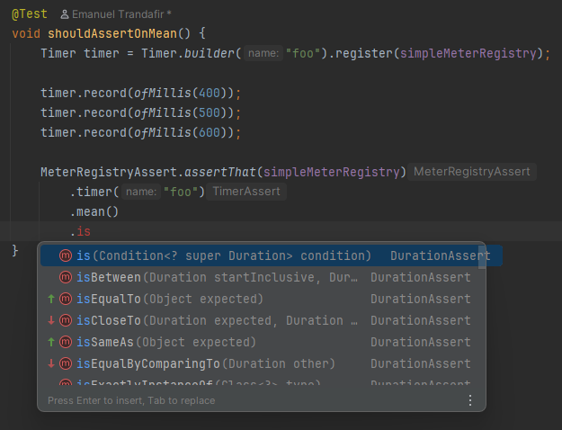

# My First Contribution to Micrometer

*Published: January 13, 2026*

[`#testing`](/#testing) [`#oss`](/#oss) `#observability`

I'm excited to share that my first contribution to the Micrometer project has been merged 
and is now available in the [1.17.0-M1 pre-release](https://github.com/micrometer-metrics/micrometer/releases)!

The contribution adds AssertJ-style assertions for various meter types,
making metric testing fun.

## Testing Without _micrometer-test_

Recently, I wrote a Baeldung article on [Testing with Micrometer](https://www.baeldung.com/micrometer-testing),
where we went over a few of the basics.

Without Micrometer's test support module, 
we can rely on the _MeterRegistry_ to fetch various meters and assert their values manually.

For example, this is how we could verify that a counter has been incremented correctly:

```java
class MicrometerUnitTest {

  MeterRegistry meterRegistry = new SimpleMeterRegistry();
  FooService fooService = new FooService(meterRegistry);

  @Test
  void whenFooIsCalled_thenCounterIsIncremented() {
    fooService.foo();
    fooService.foo();    
    fooService.foo();

    double invocations = meterRegistry.get("foo.count")
      .counter()
      .count();

    assertThat(invocations)
      .isEqualTo(3);
  }

}
```

## My Contribution - Meter Assertions

The good news is that Micrometer provides a dedicated test support module:

```xml
<dependency>
    <groupId>io.micrometer</groupId>
    <artifactId>micrometer-test</artifactId>
    <version>1.17.0-M1</version>
    <scope>test</scope>
</dependency>
```

The `micrometer-test` was available for some time, but it was only covering a few basic assertions,
such as checking the existence of a meter. 

With my contribution, we can now use the same fluent-api we know and love, for asserting meter values:

```java
@Test
void whenFooIsCalled_thenCounterIsIncremented() {
  fooService.foo();
  fooService.foo();    
  fooService.foo();

  MeterRegistryAssert.assertThat(meterRegistry)
    .counter("foo.count")
    .hasCount(3);
}
```

_Counters, Timers, Gauges_ will have different assertions available.
For instance, when it comes to verifying _Timers_, 
we'll be able to check things like the _mean()_ time, _max()_ time, and so on:


## Navigating Through the API

Looking at the _Timer_ assertions example above,
we'll notice there's no _hasMeanTime()_ or _hasMaxTime()_ method.
This is intentional: hard-coded _Duration_ values can lead to flaky tests:

```java
MeterRegistryAssert.assertThat(meterRegistry)
  .timer("foo")
  .hasMeanTime(Duration.ofMillis(500)) // <-- this looks flaky!
```

Instead of providing something like this, 
the API allows us to use _mean()_,
which enables a large variety of Duration-specific assertions,
such as _isBetween()_, _isLessThan()_, _isGreaterThan()_, _isCloseTo()_ ...etc.:




## Other Meter Types

For specialized meters like _DistributionSummary_ or _FunctionCounter_,
we can use the generic _meter()_ API:

```java
@Test
void shouldAssertOnMeasures() {
  DistributionSummary meter = DistributionSummary
    .builder("foo")
    .register(simpleMeterRegistry);

  meter.record(10.0);
  meter.record(20.0);

  MeterRegistryAssert.assertThat(meterRegistry)
    .meter("foo")
    .hasMeasurement(Statistic.COUNT, 2.0)
    .hasMeasurement(Statistic.TOTAL, 30.0)
    .hasMeasurement(Statistic.MAX, 20.0);
}
```

## Conclusion

I'm looking forward to seeing how the community uses these assertions 
and to contributing more to the Micrometer project in the future.

You can check out the full pull request at 
[github.com/micrometer-metrics/micrometer/pull/6870](https://github.com/micrometer-metrics/micrometer/pull/6870).

Big kudos to [@shakuzen](https://github.com/shakuzen) 
and [@marcingrzejszczak](https://github.com/marcingrzejszczak)
for reviewing and guiding me through the contribution process!