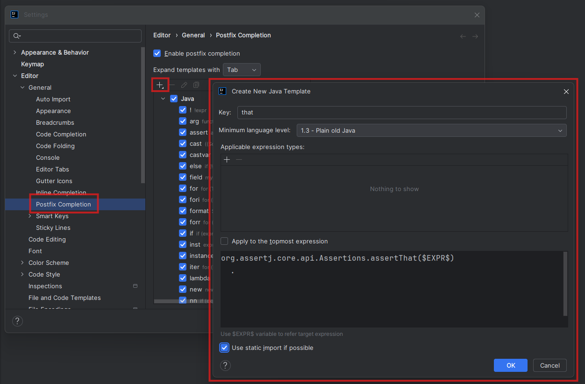
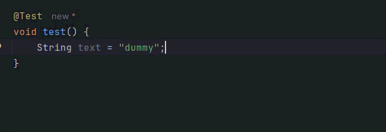

# IntelliJ's Postfix Completion Templates

*Published: June 30, 2026*

[`#tools`](/#tools)

We can use IntelliJ IDEA's postfix completion feature to quickly 
write our favorite code patterns.

For instance, instead of typing `assertThat(foo)`, 
we can type `foo.that` and let the IDE complete it.

```
PS: this only works for those who are still handcrafting code!
```

Let's do it, there are only a few simple steps:
- Navigate to _Settings → Editor → General → Postfix Completion_.
- Make sure _"Enable postfix completion"_ is checked.
- Click the plus icon to create a new template.
- Enter a key (*"that"* - for our specific example),
- Define the template body using `$EXPR$` as a placeholder for the expression.



As we can see, we checked the *"use static imports"* setting
and introduced the template that wraps the `$EXPR$` placeholder
within an Assertj assertion: 

```java
org.assertj.core.api.Assertions.assertThat($EXPR$)
  .
```

Now, we can simply use `.that` on any object or reference 
to quickly wrap it within an _AssertJ_ assertion:

<div style="text-align: center;">
  
</div>

