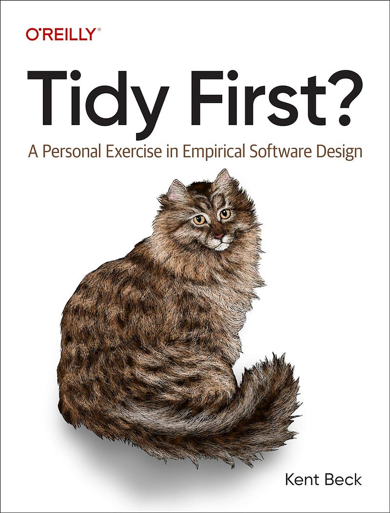

# 'Tidy First?' and my Post-Reading Commitments

*Published: April 11, 2024*

`#software design` `#books`

You know that good feeling when you come across a piece of code that's concise 
and cohesive? The code that allows you to focus on its purpose, and it 
doesn't have logic scattered all over the place?

That's the same feeling I've got reading Kent Beck's 
["Tidy First?"](https://www.oreilly.com/library/view/tidy-first/9781098151232/). 
It's a remarkably succinct book, spanning just 100 pages, divided into three sections,
each comprised of a handful of brief chapters.

Some chapters are no longer than a single page, yet they're incredibly rich in content. 
At times, I found myself revisiting certain chapters to fully absorb their insights.

## Tidyings: Small Improvements with Big Impact

The first section of the book explains what _"tidyings"_ are, and provides some 
practical examples for 15 of these small improvements. In essence, we can think of 
"tidyings" as the younger relatives of "refactorings".

Some tidyings can be as simple as extracting explanatory variables and helper functions. 
You'll probably be familiar with these techniques, and your IDE should already have 
shortcuts for pretty much all of them. However, reading through this section 
will give you a feeling of the size and granularity of these changes. 
This will help you better understand the second section about rhythm and pace.

Long story short, the concept of "refactoring" got out of hand a bit, and 
we tend to commit big batches of structural changes and justify them as refactoring.
By contrast, **tidyings are small, incremental improvements** that don't 
require a deep understanding of the codebase.

## Questions over Rules

In the second part of the book, Kent Beck discusses the **two main types of 
software changes**: those related to _structure_ and those related to _behavior_. 
He emphasizes categorizing changes into these groups and advocates for 
**separate pull requests for structural and behavioral modifications**.

While many technical books offer rigid sets of rules to adhere to, 
Tidy First? presents a set of questions and ideas that will serve as a guide 
to aid you in making the best decisions for your particular use case.

For instance, the book doesn't provide a definitive answer regarding the 
timing of structural changes: should they precede the implementation of 
the required feature? - Maybe. should they be implemented at all? - it depends.

## The Human Element

> "Software design is an exercise in human relationships"
>
> - Kent Beck

The last section of the book delves into more theoretical concepts, 
like _coupling_ and _cohesion_. Another interesting discussion in 
this section analyzes the two main attributes that make the software valuable:
**what it can do** and **what it can become**. 
Needless to say, we'll use behavioral changes to define "what software can do", 
and structural changes to keep the options open for "what it can become".

As a technical person, the importance of structural changes is obvious: 
they make future behavioral changes easy. However, these improvements 
may be less appealing to those unfamiliar with technical aspects.

Kent Beck categorizes people into **"changers"** - developers who can modify the code,
and **"observers"** - those who can only observe the system's behavior. 
He emphasizes that these two groups' ongoing collaboration and interaction 
leads to the eventual design of the system.

## My Commitments

I like the way the book is written: it offers questions rather than rules. 
It made me think of my team and our projects. It made me question big batches of changes,
regardless of their type. It made me commit that I will:

1. **Keep a short feedback loop**: use more granular PRs, merge and release more often;
2. **Use different commits** (at least) to separate behavioral and structural changes;
3. **Actively think** about how each component can evolve;
4. **Always be aware of the impact** of my changes: they should either immediately produce value
(by increasing revenue or cutting costs), or keep the options open for the future.
