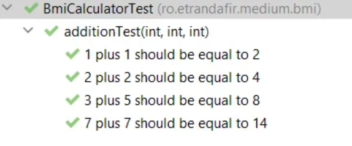
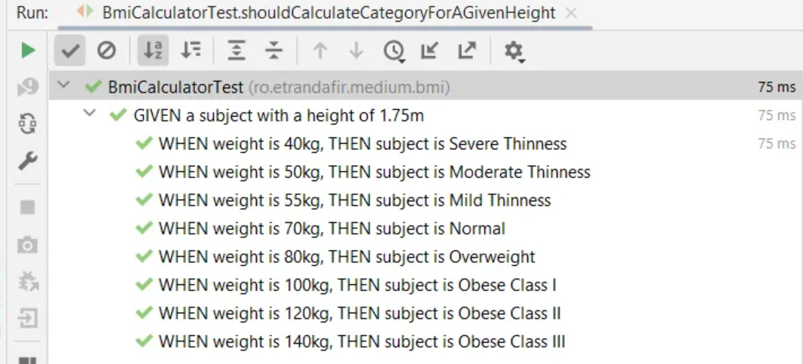

# From Parameterized Tests to BDD Specifications

*Published: March 6, 2026*

[`#testing`](/#testing) 

In this article,
we'll explore how to combine JUnit5's powerful features
with Behavior Driven Development principles
to write expressive,
maintainable tests.

We'll build a BMI (Body Mass Index) calculator
and learn how to use parameterized tests,
custom argument converters,
and BDD-style specifications
to create tests that are both readable
and decoupled from implementation details.

## The BMI Calculator

Let's start with a simple health category enum for our BMI calculator:

```java
enum BmiHealthCategory {
  SEVERE_THINNESS(Double.MIN_VALUE, 16d),
  MODERATE_THINNESS(16d, 17d),
  MILD_THINNESS(17d, 18.5d),
  NORMAL(18.5d, 25d),
  OVERWEIGHT(25d, 30d),
  OBESE_CLASS_I(30d, 35d),
  OBESE_CLASS_II(35d, 40d),
  OBESE_CLASS_III(40d, Double.MAX_VALUE);

  private final double min;
  private final double max;

  static BmiHealthCategory forBmi(double bmi) {
     return stream(values())
        .filter(category -> category.min < bmi)
        .filter(category -> category.max > bmi)
        .findFirst()
        .orElseThrow();
  }
}
```

## JUnit5's Parameterized Tests

We can use JUnit5's `@ParameterizedTest`
to provide pairs of input values and expected outputs.
This is particularly useful for computations
where we need to check outcomes for many different scenarios.


There are many ways to provide parameters for tests,
but we'll focus on `@CsvSource`.
By default,
this allows us to specify an array of strings —
each string will be used for a different test.

The strings themselves should have comma-separated values.
For example,
if we want to test the addition of two integer numbers:

```java
@ParameterizedTest
@CsvSource(value = {
    "1,1,2",
    "2,2,4",
    "3,5,8",
    "7,7,14"
})
void additionTest(int a, int b, int expectedSum) {
    assertThat(a + b).isEqualTo(expectedSum);
}
```

Moreover,
we can configure `@CsvSource` to accept a different character
as the delimiter instead of the comma.

Let's update _additionTest()_ and change the delimiter to `|`.
This makes the test parameters look like a small table:

```java
@ParameterizedTest
@CsvSource(value = {
    "1 | 1 | 2",
    "2 | 2 | 4",
    "3 | 5 | 8",
    "7 | 7 | 14"
}, delimiter = '|')
void additionTest(int a, int b, int expectedSum) {
    assertThat(a + b).isEqualTo(expectedSum);
}
```

Finally,
we can use the `name` property of `@ParameterizedTest`
to provide a nice description.
When specifying it,
we can use placeholders to reference the parameters:

```java
@ParameterizedTest(name = "{0} plus {1} should be equal to {2}")
@CsvSource(value = {
    "1 | 1 | 2",
    "2 | 2 | 4",
    "3 | 5 | 8",
    "7 | 7 | 14"
}, delimiter = '|')
void additionTest(int a, int b, int expectedSum) {
    assertThat(a + b).isEqualTo(expectedSum);
}
```



## BDD Style Tests For The BMI Calculator

Let's apply what we've learned to our BMI calculator for the following scenario:

```
GIVEN a subject with a height of 1.75m
WHEN weight is {input_weight} kg
THEN subject is {expected_category}
```

After a first try, we can come up with something like this:

```java
@DisplayName("GIVEN a subject with a height of 1.75m")
@ParameterizedTest(name = "WHEN weight is {0}kg, THEN subject is {1}")
@CsvSource(value = {
      "55 | MILD_THINNESS",
      "70 | NORMAL",
      "80 | OVERWEIGHT"
}, delimiter = '|')
void shouldCalculateCategoryForAGivenHeight(
            double weightInput, String expectedOutput) {
   //given
   var height = Height.ofMeters(1.75d);

   //when
   var weight = Weight.ofKg(weightInput);
   var category = BmiCalculator.calculate(weight, height);

   //then
   BmiHealthCategory expectedCategory = BmiHealthCategory.valueOf(expectedOutput);
   assertThat(category).isEqualTo(expectedCategory);
}
```

Though,
we can 'steal' a few more ideas from the BDD approach.
For instance,
we can try to make the test less imperative.

At this point,
the test knows how to do the conversions
to _Weight_ and _BmiHealthCategory_.
Moreover,
the specification is directly coupled to the _BmiHealthCategory_ enum.

When using Behavior Driven Development,
specifications should know as little as possible
(or nothing at all) about the implementation.
They need to be declarative and use business-related terms.

We can break this direct coupling
by using JUnit5's built-in feature:
the _ArgumentConverters_.

## Argument Converters

We can implement the _ArgumentConverter_ interface
to convert the parameters of our parameterized tests.

For example,
the following converter maps the _String_ input
from the specification to an internal _Weight_ object:

```java
static class WeightInKgConverter implements ArgumentConverter {
   @Override
   public Object convert(Object source, ParameterContext context)
         throws ArgumentConversionException {
      if (source instanceof String kgs) {
         return Weight.ofKg(Double.valueOf(kgs));
      }
      throw new IllegalArgumentException("The argument should be a double: " + source);
   }
}
```

To use it,
we need to annotate the test parameter with `@ConvertWith`
and provide the class name:

```java
@DisplayName("GIVEN a subject with a height of 1.75m")
@ParameterizedTest(name = "WHEN weight is {0}kg, THEN subject is {1}")
@CsvSource(value = {
      "55 | MILD_THINNESS",
      "70 | NORMAL",
      "80 | OVERWEIGHT"
}, delimiter = '|')
void shouldCalculateCategoryForAGivenHeight(
      @ConvertWith(WeightInKgConverter.class) Weight weight,
      String expectedOutput) {
    // ....
}
```

As a result,
if we want to use a more business-related term
for the _BmiHealthCategory_ in the specification,
we can create a converter that maps it to our internal enum.
For demonstration purposes,
let's use title-case strings with no underscore:

```java
static class BmiHealthCategoryConverter implements ArgumentConverter {
   @Override
   public Object convert(Object source, ParameterContext context)
         throws ArgumentConversionException {
      if (source instanceof String category) {
         String categoryName = category.replaceAll(" ", "_").toUpperCase();
         return BmiHealthCategory.valueOf(categoryName);
      }
      throw new IllegalArgumentException("The argument should be a String: " + source);
   }
}
```

## Conclusion

Finally, let's put everything together and take a look at the result:

```java
@DisplayName("GIVEN a subject with a height of 1.75m")
@ParameterizedTest(name = "WHEN weight is {0}kg, THEN subject is {1}")
@CsvSource(value = {
      " 40 | Severe Thinness",
      " 50 | Moderate Thinness",
      " 55 | Mild Thinness",
      " 70 | Normal",
      " 80 | Overweight",
      "100 | Obese Class I",
      "120 | Obese Class II",
      "140 | Obese Class III"
}, delimiter = '|')
void shouldCalculateCategoryForAGivenHeight(
      @ConvertWith(WeightInKgConverter.class) Weight weight,
      @ConvertWith(BmiHealthCategoryConverter.class) BmiHealthCategory expectedCategory) {
   //given
   var givenHeight = Height.ofMeters(1.75d);

   //when
   var category = BmiCalculator.calculate(weight, givenHeight);

   //then
   assertThat(category).isEqualTo(expectedCategory);
}
```

In this article,
we've explored JUnit5's features
that allow us to write expressive,
parameterized tests.
We've learned about the `@ParameterizedTest` annotation,
`@CsvSource`,
and how to create custom _ArgumentConverter_ implementations.

Moreover,
we touched on best practices when it comes to BDD specifications
and learned it's best to keep tests agnostic
from implementation details.
By using custom converters,
we can write specifications in business language
while keeping the conversion logic separate from our test logic.

