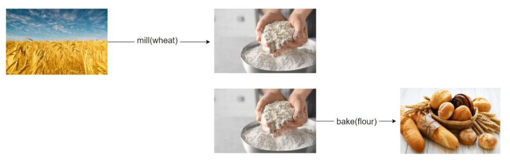
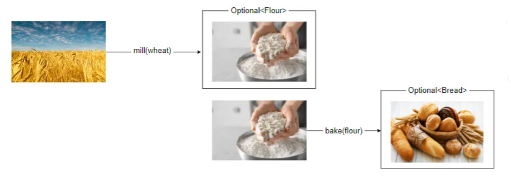
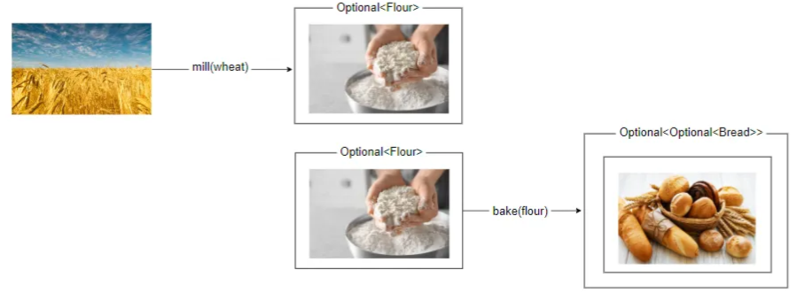

# Why _Optional<>_ is a Monad and Why the _f()_ Should I Care?

*Published: October 23, 2022*

[`#functional-programming`](/#functional-programming) [`#design`](/#design)

Please,
Use _Optional<>_ In the Intended Way!

## Overview

Firstly,
let's see where the need for _Optional_ (and for monads, in general) comes from.
To do this,
we'll start with an analogy and think of the process of making bread.

Firstly,
we'll make flour by milling the wheat;
after that,
we'll make bread using the flour from the previous step.

{ width="800" }

We can express this in programmatic or mathematical terms using functions:

```
flour = mill( wheat )
bread = bake( flour )
```

Or,
we can simply compose the two functions like this:

```
bread = bake( mill(wheat) )
```

## The Corner Cases

Unfortunately,
each step of the processing may fail for various reasons.
When composing functions like this,
error handling might be troublesome.

For instance,
maybe wheat is not always successfully processed into flour,
and the flour is not always correctly baked.

Depending on the programming language that we're using and on the context,
this can have different effects —
for instance,
an exception can be thrown,
null can be returned.. etc.

Let's pretend that,
in our case,
if something goes wrong with one of the processes,
null is returned.

```java
flour = mill( wheat )
if( flour != null ) {
   bread = bake( flour )
   if( bread != null ) {
     // .... do something()
   }
}
```

At this point,
we can no longer compose the methods due to the null checks.

## Introducing a Monad

In order to fix this,
we can wrap the result of the previous function into an object
that will continue the processing if the data is present,
and will do nothing if the data is missing.
This wrapper object will be a "monad".

For instance,
we can think of a _List_.
If there are elements inside,
they will be processed according to the next step.
On the other hand,
if the list is empty,
nothing will happen.
A _List_ is a monad.

Though,
using a _List_ here will not make much sense
because we want to only pass one object at a time from step to step.

Therefore,
we can construct our own monad object or use one of the existing ones.
There are many monads defined in the programming languages with functional features.
Depending on the language,
the monad we need might be called something like a _Maybe<>_,
_Either<>_,
or _Optional<>_.

## map() and flatMap()

Let's wrap our function return types into _Optional<>_ and try to go back to function composition:

```java
Optional<Flour> mill(Wheat wheat) { ... }
Optional<Bread> bake(Flour flour) { ... }
```

We will have a new problem now:
to compose or chain the functions,
each of them must receive the result of the previous one as a parameter.

{ width="800" }

Consequently,
the _bake()_ function must take in an _Optional<Flour>_ instead of the raw type _Flour_.

But,
because the _bake()_ function wraps the result into an _Optional<>_,
the result of the second step will be wrapped twice,
the result of the third step will be wrapped 3 times.. and so on.

{ width="800" }

The solution to this is the _flatMap()_ function.
The purpose of _flatMap()_ is to keep the structure flat
when converting from one type to another.

In other words,
we can use the following conventions on a Monad:

```
flatten : Monad<Monad<A>> → Monad<A>
map : Monad<A> → Monad<B>
flatMap : Monad<A> → Monad<Monad<B>> → Monad<B>
```

## Composing Functions VS Chaining Methods

We have now wrapped the return type for each step into a monad
and this allows us to always pass the result to the next step.

But how should we do it?
We have two possible solutions for this.

#### Composing Functions

Firstly,
we can have the functions receive and return monads:

```java
static Optional<Wheat> harvest() {
    // ...
}

static Optional<Flour> mill(Optional<Wheat> wheat) {
   // ...
}

static Optional<Bread> bake(Optional<Flour> flour) {
   // ...
}
```

This will allow us to compose the functions in a functional programming style:

```java
Optional<Bread> bread = bake( mill( harvest() ) );
```
If we read this from right to left, we can see that we're:
- harvesting the wheat
- milling the wheat into flour
- baking the flour into bread

In some languages, like Clojure, we can even use [threading macros](https://blog.etrandafir.com/blog/clojure-threading/)
to make this composition more elegant, 
and easily read from top to bottom:

```clojure
(-> (harvest)
    (mill)
    (bake))
```

#### Chaining Methods

Java is an O.O.P. language,
the _Optional_ object itself exposes the _map()_ and _flatMap()_ methods - **they aren't static!**
This means there is no need to pass an _Optional_ object as a parameter.
Instead, we should chain method calls instead of composing functions,
using _Optional's_ _map()_ and _flatMap()_:

```java
Optional<Bread> oopBread = harvest()
  .flatMap(wheat -> mill(wheat))
  .flatMap(flour -> bake(flour));
```

Or using method references:

```java
Optional<Bread> oopBread = harvest()
  .flatMap(this::mill)
  .flatMap(this::bake);
```

---

*This article was inspired by César Tron-Lozai's talk at DEVOX.*

<iframe width="560" height="315" src="https://www.youtube.com/embed/e6tWJD5q8uw?si=LDNQvs6rsj2RHxZU" title="YouTube video player" frameborder="0" allow="accelerometer; autoplay; clipboard-write; encrypted-media; gyroscope; picture-in-picture; web-share" referrerpolicy="strict-origin-when-cross-origin" allowfullscreen></iframe>